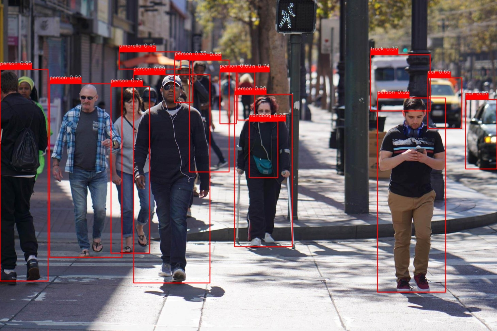

# Image Component Detection Web App

This project is a web application built with Streamlit that leverages the YOLOv5 model for object detection. The app allows users to upload an image, which is then analyzed to detect and label various components present in the image. The detected components are displayed with bounding boxes and confidence scores.

## Features

- **Image Upload**: Users can upload images in JPG, JPEG, or PNG formats.
- **Object Detection**: Utilizes a pre-trained YOLOv5 model to detect objects within the uploaded image.
- **Bounding Boxes**: Draws bounding boxes around detected objects with labels and confidence scores.
- **Component List**: Displays a list of all detected components in the image.

## Technology Stack

- **Streamlit**: For building the web application.
- **PyTorch**: For loading and using the YOLOv5 model.
- **PIL (Python Imaging Library)**: For image processing.
- **NumPy**: For numerical operations on image data.
- **OpenCV**: For drawing bounding boxes and labels on the image.

## How It Works

1. **Upload an Image**: Users can upload an image using the file uploader in the web app.
2. **Analyze Image**: When the user clicks the "Analyze Image" button, the uploaded image is processed by the YOLOv5 model to detect objects.
3. **Display Results**: The app displays the image with bounding boxes around detected objects and a list of detected components.

## Getting Started

To run this project locally, follow these steps:

1. **Clone the Repository**:
    ```bash
    git clone https://github.com/HabibaYossre/Slash-Task.git
    cd Slash-Task
    ```

2. **Install Dependencies**:
    ```bash
    pip install -r requirements.txt
    ```

3. **Run the Streamlit App**:
    ```bash
    streamlit run Deployment.py
    ```

## Example

Upload an image and see the detected components:


